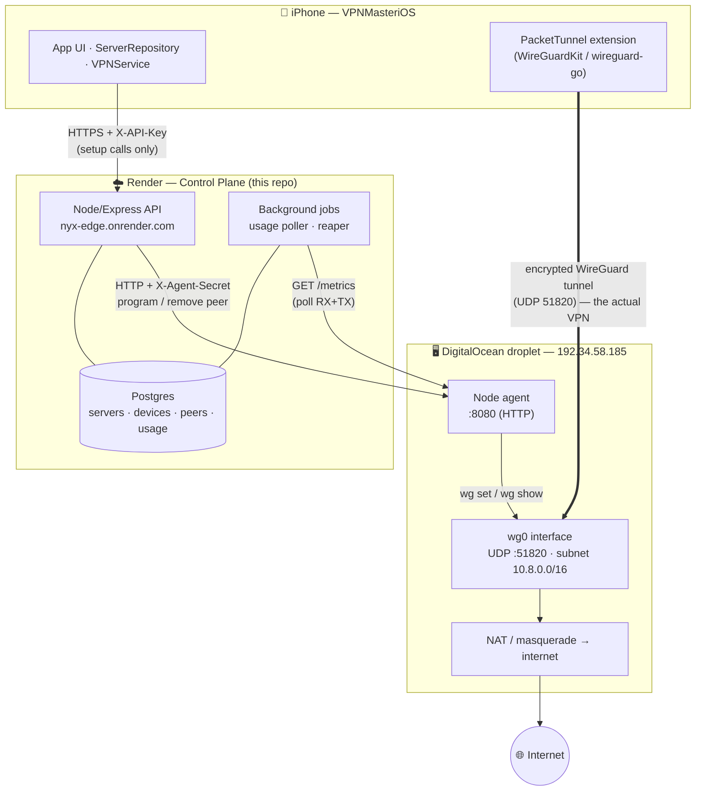
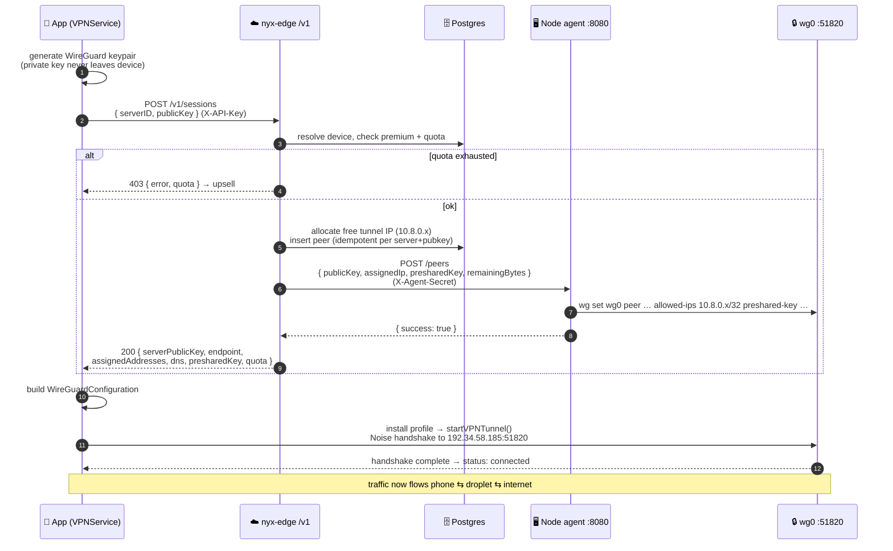
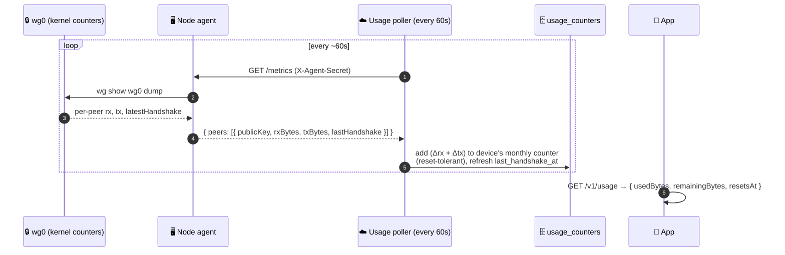
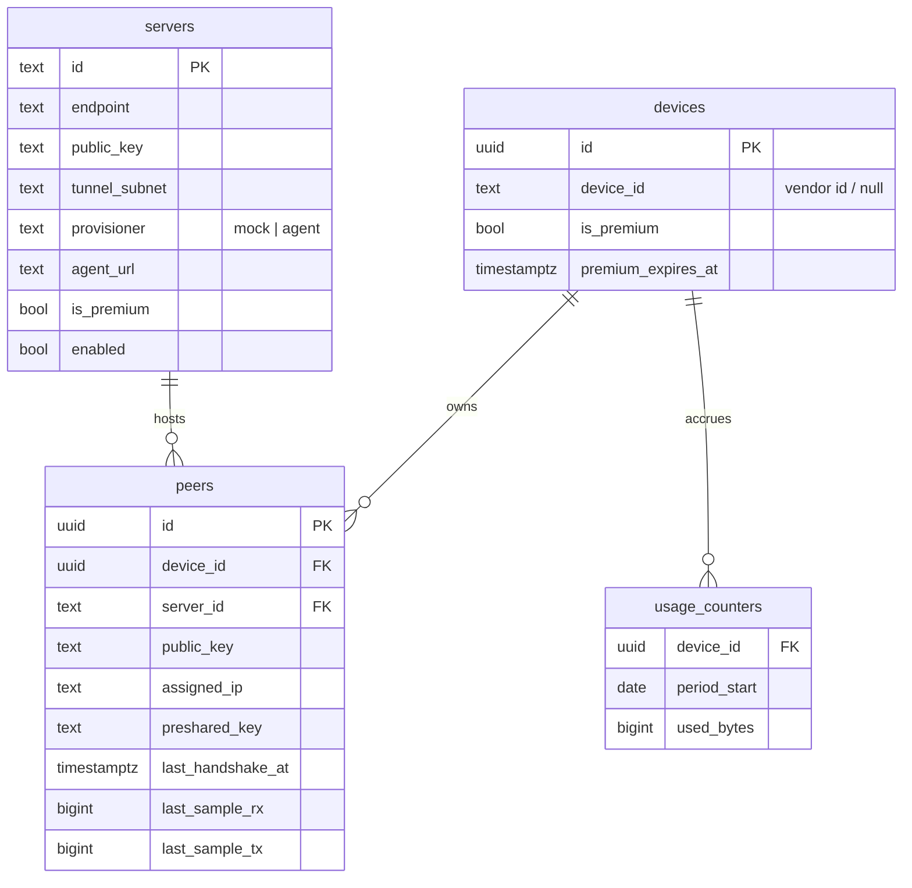

# VPN Master — System Architecture

How the whole thing fits together, end to end: the **iOS app**, the **control
plane** (this repo, on Render), the **Postgres ledger**, and the **WireGuard
node** (a DigitalOcean droplet). This is the "how it actually works now" doc —
refer to it when you come back to the project.

> Diagrams are [Mermaid](https://mermaid.js.org/) and render on GitHub.

---

## 1. The three planes

There are three independent pieces. The golden rule: **your VPN traffic never
touches Render.** Render is only the coordinator; the encrypted tunnel is
phone ⇆ droplet.

**Control path** (thin, occasional HTTPS): the app asks the API for the server
list and to register a session. **Data path** (the real VPN): the phone builds a
WireGuard tunnel straight to the droplet and its traffic exits to the internet
from there. The API is never in the packet path.

---

## 2. What each piece is

| Piece | Where | Role |
|---|---|---|
| **iOS app** | iPhone | UI + `ServerRepository` (catalog/session) + `VPNService` → `TunnelManager` (system VPN) |
| **PacketTunnel extension** | iPhone (separate process) | Runs `wireguard-go`, holds the private key, moves packets |
| **Control plane API** | Render (`nyx-edge.onrender.com`) | `/v1/*` endpoints; the only thing the app talks to over HTTPS |
| **Postgres** | Render (`vpn-master-db`) | Authoritative store: servers, devices, peers, monthly usage ledger |
| **Usage poller + reaper** | Render (in-process jobs) | Pulls `/metrics` from nodes → ledger; removes stale peers |
| **Node agent** | Droplet (`:8080`) | Only thing that runs `wg`; programs/removes peers, reports transfer |
| **WireGuard (`wg0`)** | Droplet (`UDP :51820`) | Terminates the tunnel, NATs traffic out to the internet |

---

## 3. Connecting — the full sequence

This is exactly what happens when you tap **Connect** (verified live).

Key points:
- The device sends only its **public** key; the private key stays on the phone.
- The IP allocation is transaction-locked so two connects can't grab the same IP.
- Re-registering the same public key returns the **existing** allocation (no leak).
- A preshared key (PSK) is generated per session for an extra symmetric layer.

---

## 4. Quota / metering loop

Postgres is the **ledger** (the authoritative monthly RX+TX total per device);
the node is where traffic actually happens. They're reconciled by polling.

- **Deltas, not absolutes:** the poller stores each peer's last raw reading and
  adds the difference, so counter resets (peer re-add / reboot) don't double-count.
- **Per device, across nodes:** usage is summed per device for the whole month,
  even if it roams between regions.
- **Free plan:** 1 GB/month (RX+TX combined). Served via `/v1/config`.
- ⚠️ **Not yet built:** in-kernel `nftables` enforcement (BACKEND.md §6.3). Today
  quota is *bookkeeping* — the ledger counts and `/sessions` refuses over-quota
  devices, but the node doesn't yet hard-cut traffic mid-session.

---

## 5. Session teardown & reaping

A device can vanish without a clean disconnect, so peers don't leak:

- **Explicit:** `POST /v1/sessions/close` → agent `DELETE /peers` → frees the IP.
- **Automatic:** the **reaper** removes peers whose last handshake is older than
  `PEER_TTL_MINUTES` (default 30), via the same `DELETE /peers`.

---

## 6. HTTP API (control plane)

All under `https://nyx-edge.onrender.com/v1`, all require `X-API-Key`.
Responses are **bare JSON** (no envelope) and **camelCase**.

| Method | Path | Purpose |
|---|---|---|
| GET  | `/servers` | Server catalog (`?tier=free\|premium`) |
| POST | `/sessions` | Register device pubkey as a peer; returns tunnel params + `quota` |
| POST | `/sessions/close` | Teardown: remove peer, free IP |
| POST | `/devices` | Anonymous device identity → `{ token, expiresAt }` |
| GET  | `/usage` | Current `quota` for a device (bearer token / `?deviceId` / `?publicKey`) |
| GET  | `/config` | Terms/privacy URLs, min version, DNS, plans |

**Internal (node agents only, header `X-Node-Secret`):**

| Method | Path | Purpose |
|---|---|---|
| POST | `/internal/nodes/:serverId/report` | Push-style usage report (alt to the poller) |

**Node agent API (on the droplet, header `X-Agent-Secret`):**

| Method | Path | Body | Purpose |
|---|---|---|---|
| POST   | `/peers` | `{ publicKey, assignedIp, presharedKey?, remainingBytes? }` | add/refresh peer |
| DELETE | `/peers` | `{ publicKey }` | remove peer |
| GET    | `/metrics` | — | `{ peers: [{ publicKey, rxBytes, txBytes, lastHandshake }] }` |

---

## 7. Data model (Postgres)

- `peers` is unique per `(server_id, public_key)` and `(server_id, assigned_ip)`.
- `usage_counters` is keyed `(device_id, period_start)` — one row per device per month.

---

## 8. Security & secrets

| Secret | Lives in | Guards |
|---|---|---|
| `X-API-Key` (`API_KEYS`) | app binary + Render env | every `/v1/*` request |
| `X-Agent-Secret` (`NODE_AGENT_SECRET` / droplet `AGENT_SECRET`) | Render env + droplet unit | control plane ⇆ node agent |
| `JWT_SECRET` | Render env | signs device bearer tokens |
| WireGuard **private** keys | never leave their device/node | the tunnel itself |

- The client's WireGuard private key **never leaves the phone**; the backend
  only ever sees public keys.
- The hostname is deliberately **neutral** (`nyx-edge`, no "vpn") — networks
  that do SNI-based DPI reset TLS to "vpn"-looking hostnames. This bit us during
  bring-up; the neutral name evades it.
- ⚠️ The agent link is **plain HTTP** today (`agent_url = http://…:8080`), so
  `X-Agent-Secret` travels unencrypted. Fine for a test node; put the agent
  behind HTTPS (or a private network) before production, and lock `:8080` down.

---

## 9. Ports & networking (droplet)

| Port | Proto | Who | Purpose |
|---|---|---|---|
| 51820 | UDP | the world | WireGuard tunnel (data path) |
| 8080  | TCP | control plane (ideally locked to Render) | node agent (control path) |
| 22    | TCP | you | SSH admin |

Plus: IP forwarding enabled, NAT/masquerade from `10.8.0.0/16` out to the
internet, and peers persisted via `wg-quick save` so they survive a reboot.

---

## 10. Current status

**Working & verified live**
- ✅ App → control plane → node → real WireGuard tunnel (handshake + traffic)
- ✅ Per-device monthly RX+TX ledger, updated from real node metrics
- ✅ Server catalog, session negotiation with PSK, IP allocation, reaping
- ✅ Neutral hostname, cold-start retry resilience, full request/response logging

**Pending (all optional polish)**
- 🔲 Live `/usage` polling in the app (meter that ticks while connected)
- 🔲 `nftables` byte-quota enforcement on the node (hard cut at the cap)
- 🔲 Device tokens adopted client-side (quota per-device, not per-keypair)
- 🔲 IAP receipt validation for Premium
- 🔲 Trim the 3 placeholder servers (only `us-nyc-01` is a real node)
- ✅ Render on a paid tier — web service + Postgres both paid (no cold starts,
  Postgres persists); agent behind HTTPS (`us-nyc-01` on `https://…:8443`)

See `BACKEND.md` for the full spec and `README.md` for run/deploy details.
